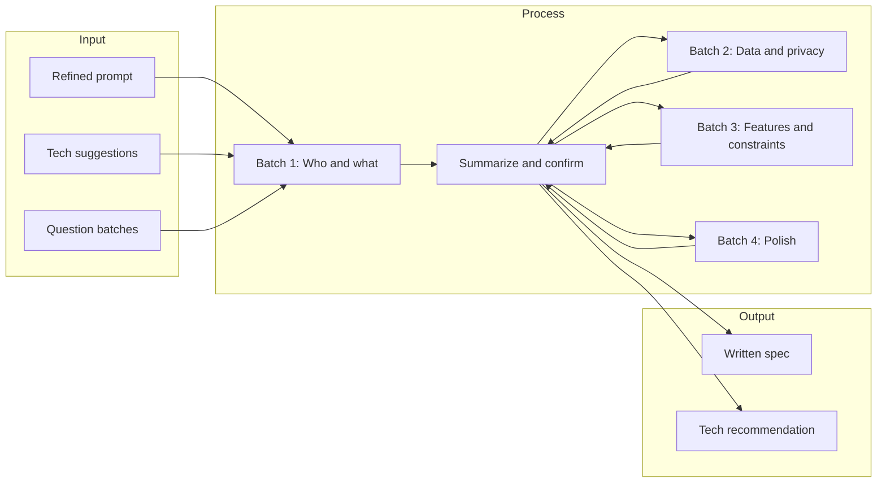

# Refined Prompt and Process for a Lightweight Windows Screentime App

## Goal

Produce a single artifact you can hand to an AI or team: a **refined prompt** plus **technology suggestions** and a **use-case discovery flow** that keeps asking questions until the software scope is clear and "perfect" for your needs.

---

## 1. The Refined Prompt (master prompt to paste)

The prompt should be copy-pasteable and structured so the AI knows to **ask first, suggest tech second, then refine**. Suggested structure:

**Opening (mandatory behavior):**

- "You are helping design a **very lightweight** Windows screentime/tracking application. Before suggesting architecture or code: (1) propose a short technology stack and (2) ask me use-case and constraint questions in batches. After each batch, summarize my answers and ask the next batch until we have a stable spec. Do not implement until I confirm the spec is complete."

**Constraints to embed in the prompt:**

- Target: **Windows only**, **minimal resource usage** (RAM, CPU, disk).
- Must track **which application (and optionally which window/URL)** has focus and for how long.
- Clarify: local-only vs cloud/sync, single user vs multi-user, and install model (portable vs installed).

**Success criteria:**

- "The outcome is a written spec (and optionally a technology recommendation) that we both agree on. Implementation starts only after I say 'spec locked' or equivalent."

This keeps the AI in "discovery and suggestion" mode instead of jumping to code.

---

## 2. Technology Suggestions to Include in the Prompt (or in the artifact)

Give the AI (or yourself) a short list of options so the prompt explicitly says: "Suggest from these or justify alternatives."

| Layer           | Option A (lightweight)                                                 | Option B (balance)                                | Option C (max control)                                               |
| --------------- | ---------------------------------------------------------------------- | ------------------------------------------------- | -------------------------------------------------------------------- |
| **App runtime** | Rust + Tauri (small binary, no Chromium)                               | C# / .NET 8 + WPF or WinUI 3                      | C++ + Win32/COM                                                      |
| **Tracking**    | Polling `GetForegroundWindow` + `GetWindowThreadProcessId` every 1–5 s | Same + optional URL via browser extensions or COM | Low-level hooks (e.g. `SetWinEventHook` for EVENT_SYSTEM_FOREGROUND) |
| **Storage**     | SQLite (one file, no server) or JSON                                   | SQLite + optional export to CSV                   | Same                                                                 |
| **UI**          | Tauri (web view, small) or minimal Win32 window                        | WPF/WinUI (native, good Windows integration)      | Win32 or minimal Qt                                                  |
| **Packaging**   | Single EXE or MSIX                                                     | MSIX or installer (e.g. Inno Setup)               | Portable ZIP or installer                                            |

**Explicitly rule out (for "very lightweight"):**

- Electron (heavy Chromium + Node).
- Full browser engine unless required for a web-based dashboard only.

**Mention in the prompt:**

- "Prefer Rust+Tauri or C#/.NET for a good balance of lightweight and maintainability; suggest C++ only if binary size or no-runtime is mandatory."

---

## 3. Use-Case Discovery: Question Batches

The prompt should say: "Ask the following in 2–3 batches; after each batch, summarize and confirm before continuing."

**Batch 1 – Who and what**

- Who is the primary user? (self, parent, employer, team.)
- What must be tracked? (apps only, app + window title, app + browser URL, categories.)
- Any apps or URLs to exclude (e.g. system, banking, incognito)?

**Batch 2 – Data and privacy**

- Where does data live? (local only, local + optional cloud backup, cloud-first.)
- Retention: how long to keep history? (e.g. 7 days, 30 days, 1 year.)
- Single machine or multiple PCs per user? (affects sync/account design.)

**Batch 3 – Features and constraints**

- Notifications or limits? (e.g. "2h on social" or "break every 45 min".)
- Reports: daily summary, weekly, export (CSV/PDF), dashboard only?
- Install: portable (no install), per-user install, or system-wide? Admin rights acceptable?
- Hard constraints: max RAM (e.g. < 50 MB), CPU (e.g. < 1% idle), no admin, no driver?

**Batch 4 – Polish and edge cases**

- Tray-only vs always-visible vs optional dashboard?
- Offline behavior: queue and sync later, or local-only?
- Multi-user on same PC (e.g. family) or single user per machine?

After each batch, the AI (or you) should output: "Summary: … Next batch: …" and only proceed when you confirm.

---

## 4. What You Get at the End

- **Stable spec:** 1–2 page description (users, tracking scope, data location, features, constraints).
- **Technology choice:** One recommended stack with short justification.
- **Optional:** A one-page "anti-spec" (what we are *not* building) to avoid scope creep.

---

## 5. Deliverable Format

**Option A (recommended):** Create one markdown file in the repo (e.g. `docs/SCREENTIME_APP_SPEC_PROMPT.md` or in project root) containing:

1. The refined prompt (Section 1) as a copy-paste block.
2. The technology table and "rule out" notes (Section 2).
3. The four question batches (Section 3) so the AI (or a human) can run the process.
4. A short "Spec template" (empty headings: Users, Tracking, Data, Features, Constraints, Tech choice) to fill after discovery.

**Option B:** You use this plan as the prompt itself: paste the plan into a new chat and say "Follow this process; start with Batch 1 and suggest a technology stack."

---

## 6. Flow Diagram (process overview)

No implementation or file creation is done in this plan step; this plan only defines the content and process. After you approve, the next step can be to create `SCREENTIME_APP_SPEC_PROMPT.md` (or the chosen path) with the above content.